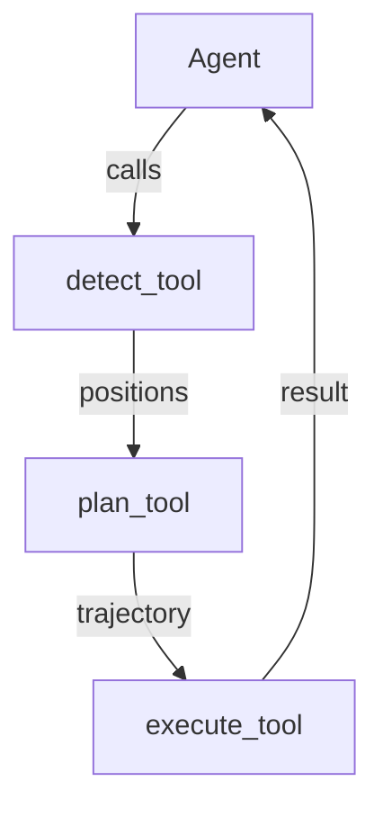

This is an experimental project on exploring the recreation of a pick-and-place using an agentic approach.

# Agentic-MEX5 :robot:

Robotic grasping system with tool-calling agent architecture

## Architecture


## Components
1. **Agent** (`agent.py`)
   - Uses `smolagents` library with Ollama/Qwen LLM
   - Orchestrates tool calling workflow
   - Enforces strict I/O formatting between tools

2. **MCP Server** (`mcp_server.py`)
   - FastAPI-based tool server
   - Exposes 3 core tools as HTTP endpoints
   - Handles dataclass serialization

3. **Robotic Simulator** (`robograb.py`)
   - Simulates object detection and movement
   - Provides realistic success/failure responses
   - Uses dataclasses for clean type hints

## Installation
```bash
uv venv
source .venv/bin/activate
pip install -r requirements.txt
```

## Requirements
Core dependencies:
```python
fastmcp==2.10.5  # MCP server framework
smolagents==1.20.0  # Tool-calling agent
ollama  # For local LLM access
opencv-python  # For vision (future use)
```

## Usage
1. Start MCP server:
```bash
python mcp_server.py
```

2. Run agent:
```bash
python agent.py
```

3. Example workflow:
```python
# Agent will automatically:
# 1. Detect object position
# 2. Plan trajectory 
# 3. Execute movement
# 4. Retry on failure (3 attempts)
```

## Configuration
Edit `agent.py` to:
- Change LLM model (`ollama/qwen3:4b`)
- Adjust temperature (0.2)
- Modify system prompt

## Future Work
- [ ] Add real camera input
- [ ] Integrate with Franka Emika
- [ ] Test and to end

## License
MIT